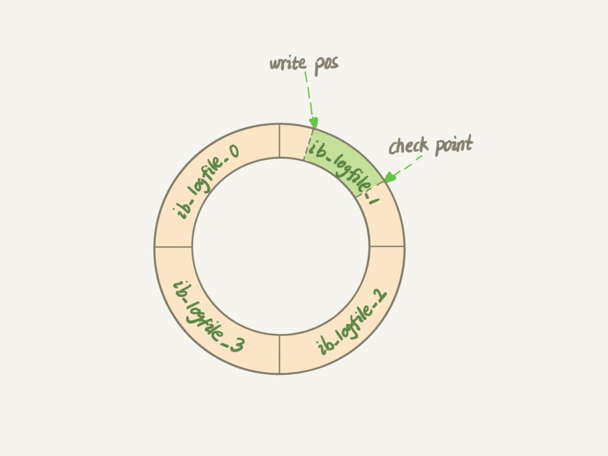
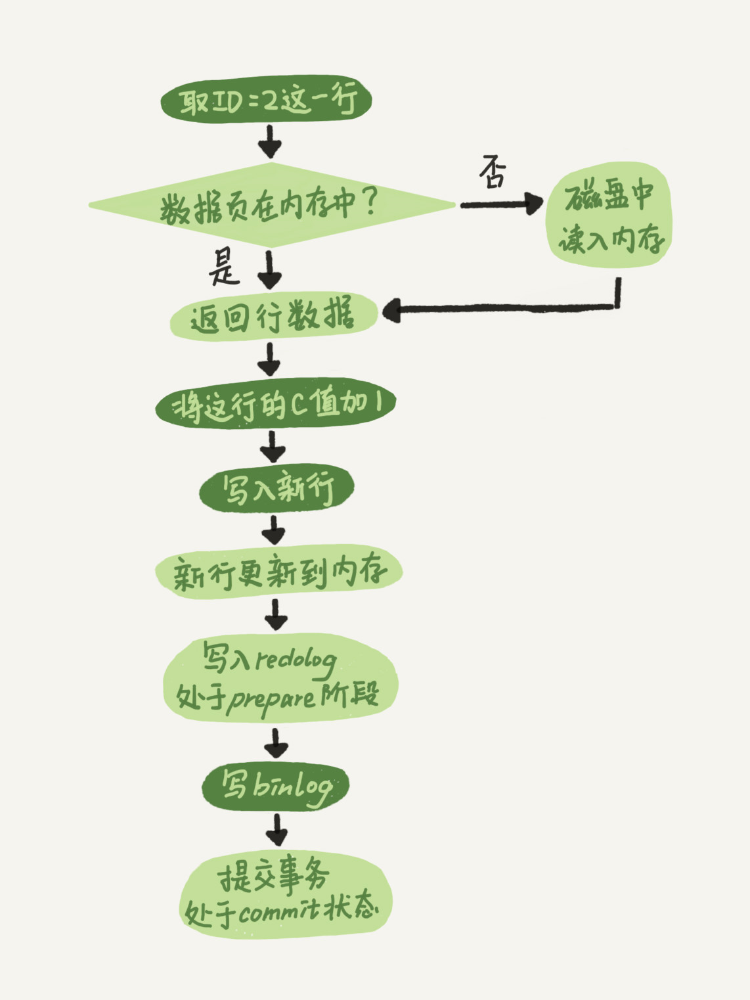
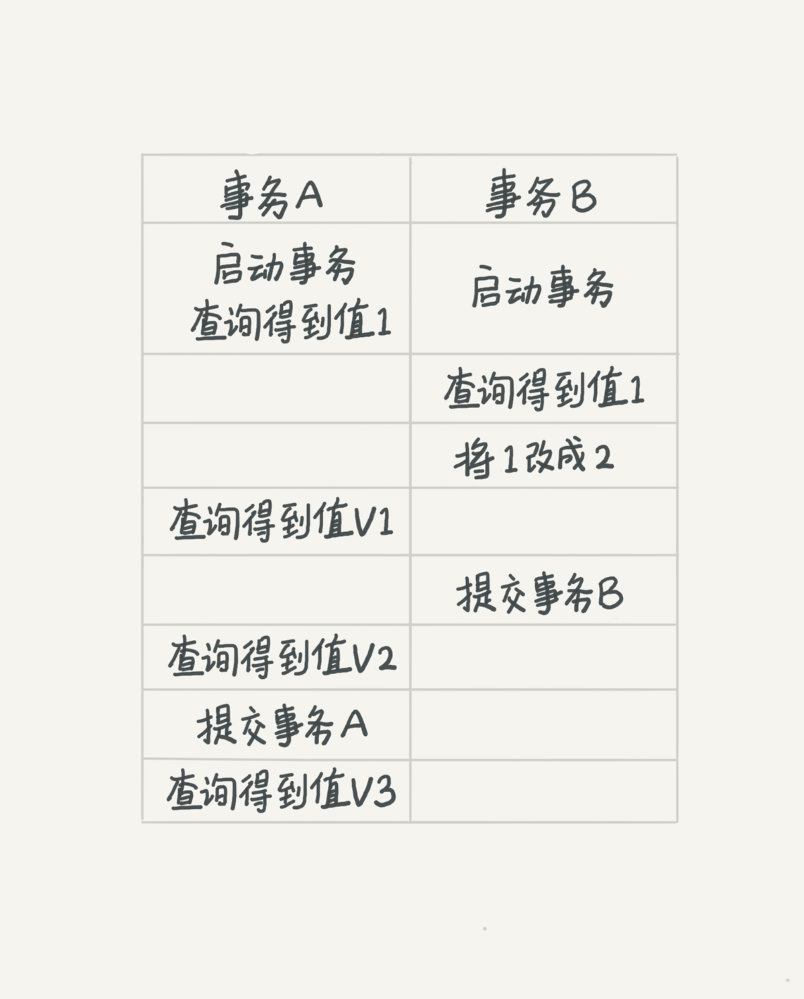

# 基础架构:一条SQL查询语句是如何执行的？

大体来说，MySQL 可以分为 Server 层和存储引擎层两部分。  
Server 层包括连接器、查询缓存、分析器、优化器、执行器等，涵盖 MySQL 的大多数核心服务功能，以及所有的内置函数（如日期、时间、数学和加密函数等），所有跨存储引擎的功能都在这一层实现，比如存储过程、触发器、视图等。  
而存储引擎层负责数据的存储和提取。其架构模式是插件式的，支持 InnoDB、MyISAM、Memory 等多个存储引擎。现在最常用的存储引擎是 InnoDB，它从 MySQL 5.5.5 版本开始成为了默认存储引擎。
## 连接器
第一步，你会先连接到这个数据库上，这时候接待你的就是连接器。连接器负责跟客户端建立连接、获取权限、维持和管理连接。  
数据库里面，长连接是指连接成功后，如果客户端持续有请求，则一直使用同一个连接。短连接则是指每次执行完很少的几次查询就断开连接，下次查询再重新建立一个。  
建立连接的过程通常是比较复杂的，所以我建议你在使用中要尽量减少建立连接的动作，也就是尽量使用长连接。但是全部使用长连接后，你可能会发现，有些时候 MySQL 占用内存涨得特别快，这是因为 MySQL 在执行过程中临时使用的内存是管理在连接对象里面的。这些资源会在连接断开的时候才释放。所以如果长连接累积下来，可能导致内存占用太大，被系统强行杀掉（OOM），从现象看就是 MySQL 异常重启了。  
怎么解决这个问题呢？你可以考虑以下两种方案。  
1. 定期断开长连接。使用一段时间，或者程序里面判断执行过一个占用内存的大查询后，断开连接，之后要查询再重连。  
2. 如果你用的是 MySQL 5.7 或更新版本，可以在每次执行一个比较大的操作后，通过执行 mysql_reset_connection 来重新初始化连接资源。这个过程不需要重连和重新做权限验证，但是会将连接恢复到刚刚创建完时的状态。
## ~~查询缓存~~
连接建立完成后，你就可以执行 select 语句了。执行逻辑就会来到第二步：查询缓存。  
MySQL 拿到一个查询请求后，会先到查询缓存看看，之前是不是执行过这条语句。之前执行过的语句及其结果可能会以 key-value 对的形式，被直接缓存在内存中。key 是查询的语句，value 是查询的结果。如果你的查询能够直接在这个缓存中找到 key，那么这个 value 就会被直接返回给客户端。  
如果语句不在查询缓存中，就会继续后面的执行阶段。执行完成后，执行结果会被存入查询缓存中。你可以看到，如果查询命中缓存，MySQL 不需要执行后面的复杂操作，就可以直接返回结果，这个效率会很高。  
需要注意的是，MySQL 8.0 版本直接将查询缓存的整块功能删掉了，查询缓存的失效非常频繁，只要有对一个表的更新，这个表上所有的查询缓存都会被清空。因此很可能你费劲地把结果存起来，还没使用呢，就被一个更新全清空了。
## 分析器
select SQL_CACHE * from T where ID=10；
如果没有命中查询缓存，就要开始真正执行语句了。首先，MySQL 需要知道你要做什么，因此需要对 SQL 语句做解析。  
分析器先会做“词法分析”。你输入的是由多个字符串和空格组成的一条 SQL 语句，MySQL 需要识别出里面的字符串分别是什么，代表什么。  
MySQL 从你输入的"select"这个关键字识别出来，这是一个查询语句。它也要把字符串“T”识别成“表名 T”，把字符串“ID”识别成“列 ID”。  
做完了这些识别以后，就要做“语法分析”。根据词法分析的结果，语法分析器会根据语法规则，判断你输入的这个 SQL 语句是否满足 MySQL 语法。
## 优化器
经过了分析器，MySQL 就知道你要做什么了。在开始执行之前，还要先经过优化器的处理。  
优化器是在表里面有多个索引的时候，决定使用哪个索引；或者在一个语句有多表关联（join）的时候，决定各个表的连接顺序。
## 执行器
MySQL 通过分析器知道了你要做什么，通过优化器知道了该怎么做，于是就进入了执行器阶段，开始执行语句。  
开始执行的时候，要先判断一下你对这个表 T 有没有执行查询的权限，如果没有，就会返回没有权限的错误，(在工程实现上，如果命中查询缓存，会在查询缓存返回结果的时候，做权限验证。查询也会在优化器之前调用 precheck 验证权限)。  
如果有权限，就打开表继续执行。打开表的时候，执行器就会根据表的引擎定义，去使用这个引擎提供的接口。  
执行器的执行流程是这样的：
1. 调用 InnoDB 引擎接口取这个表的第一行，判断 ID 值是不是 10，如果不是则跳过，如果是则将这行存在结果集中；
2. 调用引擎接口取“下一行”，重复相同的判断逻辑，直到取到这个表的最后一行。
3. 执行器将上述遍历过程中所有满足条件的行组成的记录集作为结果集返回给客户端。

至此，这个语句就执行完成了。  
对于有索引的表，执行的逻辑也差不多。第一次调用的是“取满足条件的第一行”这个接口，之后循环取“满足条件的下一行”这个接口，这些接口都是引擎中已经定义好的。  
你会在数据库的慢查询日志中看到一个 rows_examined 的字段，表示这个语句执行过程中扫描了多少行。**这个值就是在执行器每次调用引擎获取数据行的时候累加的。**  
在有些场景下，执行器调用一次，在引擎内部则扫描了多行，因此引擎扫描行数跟 rows_examined 并不是完全相同的。
# 日志系统：一条SQL更新语句是如何执行的？
首先，可以确定的说，查询语句的那一套流程，更新语句也是同样会走一遍。  
与查询流程不一样的是，更新流程还涉及两个重要的日志模块，它们正是我们今天要讨论的主角：redo log（重做日志）和 binlog（归档日志）。  
## 重要的日志模块：redo log
WAL 的全称是 Write-Ahead Logging，它的关键点就是先写日志，再写磁盘，也就是先写粉板，等不忙的时候再写账本。  
具体来说，当有一条记录需要更新的时候，InnoDB 引擎就会先把记录写到 redo log（粉板）里面，并更新内存，这个时候更新就算完成了。同时，InnoDB 引擎会在适当的时候，将这个操作记录更新到磁盘里面，而这个更新往往是在系统比较空闲的时候做，这就像打烊以后掌柜做的事。  
InnoDB 的 redo log 是固定大小的，比如可以配置为一组 4 个文件，每个文件的大小是 1GB，那么这块“粉板”总共就可以记录 4GB 的操作。从头开始写，写到末尾就又回到开头循环写，如下面这个图所示。  
  
write pos 是当前记录的位置，一边写一边后移，写到第 3 号文件末尾后就回到 0 号文件开头。checkpoint 是当前要擦除的位置，也是往后推移并且循环的，擦除记录前要把记录更新到数据文件。  
write pos 和 checkpoint 之间的是“粉板”上还空着的部分，可以用来记录新的操作。如果 write pos 追上 checkpoint，表示“粉板”满了，这时候不能再执行新的更新，得停下来先擦掉一些记录，把 checkpoint 推进一下。  
有了 redo log，InnoDB 就可以保证即使数据库发生异常重启，之前提交的记录都不会丢失，这个能力称为 crash-safe。
## 重要的日志模块：binlog
MySQL 整体来看，其实就有两块：一块是 Server 层，它主要做的是 MySQL 功能层面的事情；还有一块是引擎层，负责存储相关的具体事宜。上面我们聊到的粉板 **redo log 是 InnoDB 引擎特有的日志**，而 Server 层也有自己的日志，称为 binlog（归档日志）。  
最开始 MySQL 里并没有 InnoDB 引擎。MySQL 自带的引擎是 MyISAM，但是 MyISAM 没有 crash-safe 的能力，binlog 日志只能用于归档。而 InnoDB 是另一个公司以插件形式引入 MySQL 的，既然只依靠 binlog 是没有 crash-safe 能力的，所以 InnoDB 使用另外一套日志系统——也就是 redo log 来实现 crash-safe 能力。  
这两种日志有以下三点不同。
1. redo log 是 InnoDB 引擎特有的；binlog 是 MySQL 的 Server 层实现的，所有引擎都可以使用。
2. redo log 是物理日志，记录的是“在某个数据页上做了什么修改”；binlog 是逻辑日志，记录的是这个语句的原始逻辑，比如“给 ID=2 这一行的 c 字段加 1 ”。

图中浅色框表示是在 InnoDB 内部执行的，深色框表示是在执行器中执行的。

`update T set c=c+1 where ID=2;`
1. 执行器先找引擎取 ID=2 这一行。ID 是主键，引擎直接用树搜索找到这一行。如果 ID=2 这一行所在的数据页本来就在内存中，就直接返回给执行器；否则，需要先从磁盘读入内存，然后再返回。
2. 执行器拿到引擎给的行数据，把这个值加上 1，比如原来是 N，现在就是 N+1，得到新的一行数据，再调用引擎接口写入这行新数据。
3. 引擎将这行新数据更新到内存中，同时将这个更新操作记录到 redo log 里面，此时 redo log 处于 prepare 状态。然后告知执行器执行完成了，随时可以提交事务。
4. 执行器生成这个操作的 binlog，并把 binlog 写入磁盘。
5. 执行器调用引擎的提交事务接口，引擎把刚刚写入的 redo log 改成提交（commit）状态，更新完成。  
## 两阶段提交
由于 redo log 和 binlog 是两个独立的逻辑，如果不用两阶段提交，要么就是先写完 redo log 再写 binlog，或者采用反过来的顺序。  
`update T set c=c+1 where ID=2;`  
假设当前 ID=2 的行，字段 c 的值是 0，再假设执行 update 语句过程中在写完第一个日志后，第二个日志还没有写完期间发生了 crash，会出现什么情况呢？` 
1. 先写 redo log 后写 binlog。假设在 redo log 写完，binlog 还没有写完的时候，MySQL 进程异常重启。由于我们前面说过的，redo log 写完之后，系统即使崩溃，仍然能够把数据恢复回来，所以恢复后这一行 c 的值是 1。但是由于 binlog 没写完就 crash 了，这时候 binlog 里面就没有记录这个语句。因此，之后备份日志的时候，存起来的 binlog 里面就没有这条语句。  
 然后你会发现，如果需要用这个 binlog 来恢复临时库的话，由于这个语句的 binlog 丢失，这个临时库就会少了这一次更新，恢复出来的这一行 c 的值就是 0，与原库的值不同。
2. 先写 binlog 后写 redo log。如果在 binlog 写完之后 crash，由于 redo log 还没写，崩溃恢复以后这个事务无效，所以这一行 c 的值是 0。但是 binlog 里面已经记录了“把 c 从 0 改成 1”这个日志。所以，在之后用 binlog 来恢复的时候就多了一个事务出来，恢复出来的这一行 c 的值就是 1，与原库的值不同。

可以看到，如果不使用“两阶段提交”，那么数据库的状态就有可能和用它的日志恢复出来的库的状态不一致。  
不只是误操作后需要用这个过程来恢复数据。当你需要扩容的时候，也就是需要再多搭建一些备库来增加系统的读能力的时候，现在常见的做法也是用全量备份加上应用 binlog 来实现的，这个“不一致”就会导致你的线上出现主从数据库不一致的情况。简单说，redo log 和 binlog 都可以用于表示事务的提交状态，而两阶段提交就是让这两个状态保持逻辑上的一致。  
##小结
redo log 用于保证 crash-safe 能力。innodb_flush_log_at_trx_commit 这个参数设置成 1 的时候，表示每次事务的 redo log 都直接持久化到磁盘。这个参数我建议你设置成 1，这样可以保证 MySQL 异常重启之后数据不丢失。  
sync_binlog 这个参数设置成 1 的时候，表示每次事务的 binlog 都持久化到磁盘。这个参数我也建议你设置成 1，这样可以保证 MySQL 异常重启之后 binlog 不丢失。    
两阶段提交是跨系统维持数据逻辑一致性时常用的一个方案，即使你不做数据库内核开发，日常开发中也有可能会用到。  
# 事务隔离：为什么你改了我还看不见？
事务就是要保证一组数据库操作，要么全部成功，要么全部失败。在 MySQL 中，事务支持是在引擎层实现的。MySQL 是一个支持多引擎的系统，但并不是所有的引擎都支持事务。比如 MySQL 原生的 MyISAM 引擎就不支持事务，这也是 MyISAM 被 InnoDB 取代的重要原因之一。
## 隔离性与隔离级别
当数据库上有多个事务同时执行的时候，就可能出现脏读（dirty read）、不可重复读（non-repeatable read）、幻读（phantom read）的问题，为了解决这些问题，就有了“隔离级别”的概念。  
隔离得越严实，效率就会越低。因此很多时候，我们都要在二者之间寻找一个平衡点。SQL 标准的事务隔离级别包括：读未提交（read uncommitted）、读提交（read committed）、可重复读（repeatable read）和串行化（serializable ）。  
* 读未提交是指，一个事务还没提交时，它做的变更就能被别的事务看到。
* 读提交是指，一个事务提交之后，它做的变更才会被其他事务看到。
* 可重复读是指，一个事务执行过程中看到的数据，总是跟这个事务在启动时看到的数据是一致的。当然在可重复读隔离级别下，未提交变更对其他事务也是不可见的。
* 串行化，顾名思义是对于同一行记录，“写”会加“写锁”，“读”会加“读锁”。当出现读写锁冲突的时候，后访问的事务必须等前一个事务执行完成，才能继续执行。  

假设数据表 T 中只有一列，其中一行的值为 1，下面是按照时间顺序执行两个事务的行为。    
* 若隔离级别是“读未提交”， 则 V1 的值就是 2。这时候事务 B 虽然还没有提交，但是结果已经被 A 看到了。因此，V2、V3 也都是 2。
* 若隔离级别是“读提交”，则 V1 是 1，V2 的值是 2。事务 B 的更新在提交后才能被 A 看到。所以， V3 的值也是 2。
* 若隔离级别是“可重复读”，则 V1、V2 是 1，V3 是 2。之所以 V2 还是 1，遵循的就是这个要求：事务在执行期间看到的数据前后必须是一致的。
* 若隔离级别是“串行化”，则在事务 B 执行“将 1 改成 2”的时候，会被锁住。直到事务 A 提交后，事务 B 才可以继续执行。所以从 A 的角度看， V1、V2 值是 1，V3 的值是 2。  

在实现上，**数据库里面会创建一个视图，访问的时候以视图的逻辑结果为准**。在“可重复读”隔离级别下，这个视图是在事务启动时创建的，整个事务存在期间都用这个视图。在“读提交”隔离级别下，这个视图是在每个 SQL 语句开始执行的时候创建的。这里需要注意的是，“读未提交”隔离级别下直接返回记录上的最新值，没有视图概念；而“串行化”隔离级别下直接用加锁的方式来避免并行访问。  
在不同的隔离级别下，数据库行为是有所不同的。Oracle 数据库的默认隔离级别其实就是“读提交”，因此对于一些从 Oracle 迁移到 MySQL 的应用，为保证数据库隔离级别的一致，你一定要记得将 MySQL 的隔离级别设置为“读提交”。
## 事务隔离的实现
在 MySQL 中，实际上每条记录在更新的时候都会同时记录一条回滚操作。记录上的最新值，通过回滚操作，都可以得到前一个状态的值。  
