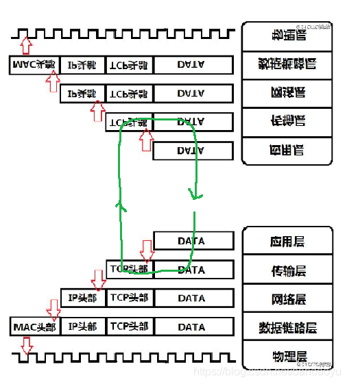
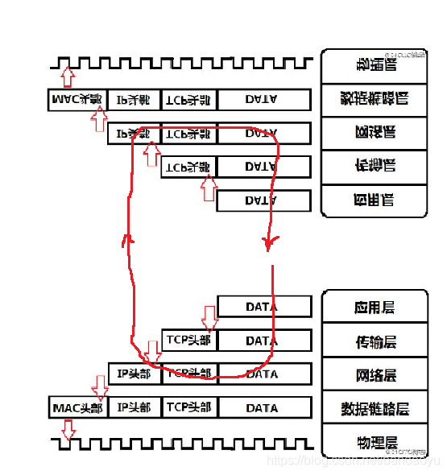

在windows安装 DockerDesktop 实际docker引擎还是运行在linux内核上的.
所以需要Windows上有可以支持docker引擎的linux内核,用到了Windows的wsl.  
WSL:Windows Subsystem for Linux 是一个在Windows 10\11上能够运行原生Linux二进制可执行文件（ELF格式）的兼容层。
它是由微软与Canonical公司合作开发，其目标是使纯正的Ubuntu、Debian等映像能下载和解压到用户的本地计算机，并且映像内的工具和实用工具能在此子系统上原生运行.

记录一些遇到的坑:  
前提条件:  
物理机:现实中存在的电脑,是Windows操作系统.
wsl:理解为物理机上Windows操作系统的子系统,这里应该是我安装的Ubuntu的linux
DockerDesktop:我在物理机上安装的一个程序,实际该程序的安转要依赖于wsl的linux.
docker容器:运行在docker引擎上的docker镜像文件,可以看做一个只有基础功能的linux系统.
1. 由于是在Docker Desktop中实现网络的方式,无法在主机上看到docker0,docker0实际上位于虚拟机(是哪个不知道,猜测是wsl)中.
2. `docker run -p 8000:80 -d nginx`Docker Desktop使容器中80端口上运行的任何内容在物理机端口8000上可用.  
   我理解的是 容器运行在docker中,docker运行在wsl中,wsl属于物理机.这里直接把容器的端口映射到物理机上.
3. 我在wsl中安装ssh工具,想通过远程连接wsl,但是需要将ssh的监听端口映射到物理机上.即 外部设备无法直接访问wsl,只能先访问物理机,物理机把请求转发给wsl.  
   `netsh interface portproxy add v4tov4 listenaddress=172.1.1.98 listenport=2222 connectaddress=172.19.74.68 connectport=2222`  
   监听172.1.1.98(物理机的ip)的2222端口 转发到172.19.74.68(wsl的ip)的端口2222被安转在wsl中的ssh监听到.(ssh只能监听wsl的端口,2222是在ssh设置的).  
   这里和Docker Desktop就不一样,Docker Desktop可以直接把运行的在wsl上的docker上的容器的端口转发到物理机上.
4. 远程设备,要使用docker. 使用tcp连接.  在Docker Desktop的设置了 Expose daemon on tcp://localhost:2375 without TLS,还需要在物理机配置转发.  
   `netsh interface portproxy add v4tov4 listenaddress=172.1.1.98 listenport=2375 connectaddress=localhost connectport=2222`  
   和上面的有区别,ssh是物理机转发到wsl的ip,这个是转发到localhost. 但是无法通过物理机的ip访问.
5. localhost 127.0.0.1 本机ip
   1. localhost 不会解析成ip,也不会占用网卡,网络资源.  
      使用localhost访问,请求从应用层解析到传输层,直接在传输层请求本机上对应的应用,再反解析成应用层请求.  
      
   2. 127.0.0.1 有ip,直到网络层ip走网卡,不走链路层MAC
      127 开头的是回环地址,有ip但不是网络ip,不经过链路层,在ip层就回去,依赖网卡,并受到网络防火墙和网卡相关的限制.  
      
   3. 本机ip 可以被本机和外部访问.  
      localhost首先是一个域名,也是本机地址,它可以被配置为任意的ip地址,不同通常指向127.0.0.1  
      
6. 127.0.0.1 是一个回送地址,指本地机,一般用来测试使用.  
   127.0.0.1通过网卡传输,依赖网卡,并受到网络防火墙和网卡相关的限制,localhost不走网卡,因此防火墙的设置对localhost无效.  
   正常的网络包都是从ip层进入链路层,然后发送到网络上,而发向127.0.0.1的包,直接在ip层短路了,也就是发到ip层的包直接被ip层接收了,不再向下发送.  
   这也就决定了web应用绑定在127.0.0.1上是不可能被公网访问到的.

